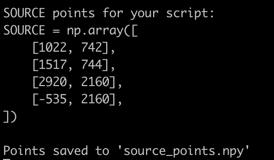

# Perspective Calibrator

A tool for calibrating perspective transformation points, specifically designed for use with vehicle speed estimation using [Roboflow Supervision](https://github.com/roboflow/supervision).


## What does it do?

I would recommend watching this [great tutorial video](https://youtu.be/uWP6UjDeZvY?t=413) from Roboflow. Our tool helps you calculate the transformation and set the `SOURCE` points required for perspective transformation in speed estimation projects. It's particularly useful for the [speed estimation example](https://github.com/roboflow/supervision/tree/develop/examples/speed_estimation) from Roboflow - and maybe for similar tasks using other tools.

## Installation

```bash
# Create virtual environment
python3 -m venv venv
source venv/bin/activate  # On Windows: venv\Scripts\activate

# Install requirements
pip install -r requirements.txt
```

## Usage

1. Run with a video or image:
```bash
python perspective_calibrator.py --video your_video.mp4
# OR
python perspective_calibrator.py --image your_image.jpg
```

2. Click to place 4 points in this order:
   - Top left 
   - Top right (same distance from camera as top left)
   - Bottom right
   - Bottom left (same distance from camera as bottom right)

3. Use keyboard controls:
   - `r` - Reset points
   - `p` - Preview transformation
   - `s` - Save points to 'source_points.npy'
   - `q` - Quit

The tool will output the SOURCE points in the format needed for the speed estimation example:
```python
SOURCE = np.array([
    [x1, y1],  # Top left
    [x2, y2],  # Top right
    [x3, y3],  # Bottom right
    [x4, y4]   # Bottom left
])
```




## Why this tool?

The speed estimation example uses perspective transformation to convert video footage into a birds-eye view for accurate speed calculations. Getting these SOURCE points right is crucial for accurate speed measurements.

Instead of manually trying coordinates, this tool lets you:
- Visually select points
- See the transformation in real-time
- Get properly formatted points for the speed estimation code

## Requirements
- Python 3.8+
- OpenCV >= 4.8.0
- NumPy >= 1.24.0

## License
MIT License

## Related Projects
- [Supervision Speed Estimation Example](https://github.com/roboflow/supervision/tree/develop/examples/speed_estimation)
- [Supervision Library](https://github.com/roboflow/supervision)
